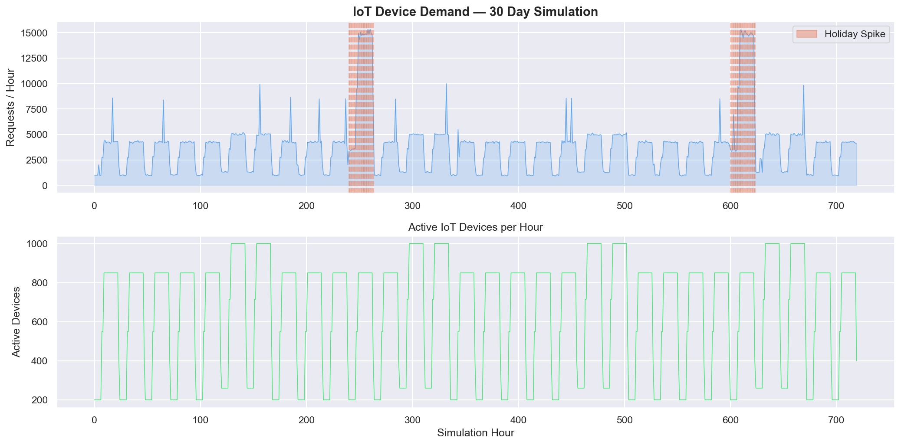
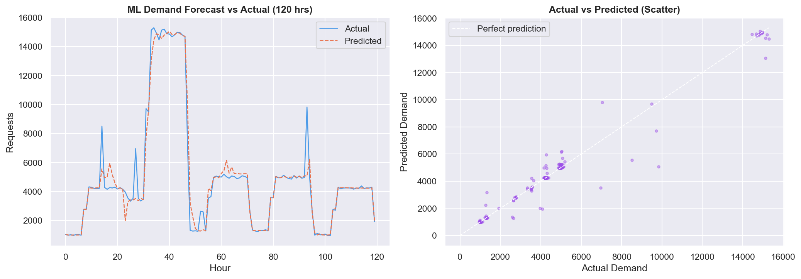
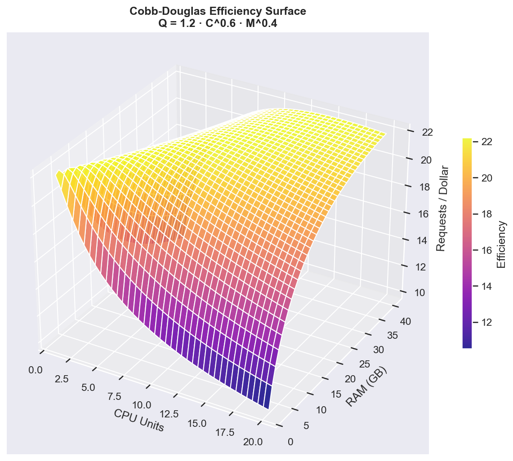
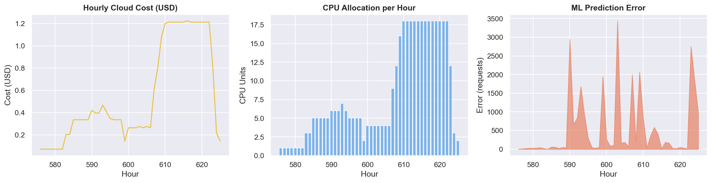

# ☁️ CloudSim IQ — Cloud Resource Allocation Optimizer

> A mathematical + ML approach to intelligent cloud scaling,
> inspired by real-world IoT and blockchain use cases.


---

## 🧠 What This Project Does

CloudSim IQ simulates the full pipeline of an intelligent 
cloud resource manager:

1. **IoT Layer** — Simulates 1,000 smart devices generating 
   real-world traffic patterns (day/night cycles, holiday spikes)
2. **ML Layer** — Random Forest model predicts next-hour demand 
   so resources scale *before* the spike hits
3. **Math Layer** — Cobb-Douglas production function computes 
   the most cost-efficient CPU + RAM allocation
4. **Blockchain Layer** — Every allocation decision is logged 
   as an immutable block, creating a tamper-proof audit trail

---

## 📊 Visualizations

| IoT Demand | ML Predictions |
|---|---|
|  |  |

| Cobb-Douglas Surface | Blockchain Audit |
|---|---|
|  |  |

---

## 🔬 Concepts Applied

- **Cobb-Douglas Production Function** (Q = A·C^α·M^β) 
  adapted from production economics to model cloud throughput
- **Poisson distribution** for realistic IoT request modeling
- **Lag features + Rolling averages** for time-series ML
- **SHA-256 hashing** for blockchain integrity
- **Pay-as-you-go cost modeling** (AWS-style pricing)

---

## ▶️ How to Run

```bash
git clone https://github.com/YOUR_USERNAME/cloudsim-iq.git
cd cloudsim-iq
pip install -r requirements.txt
python main.py
```

---

## 📁 Project Structure

```
cloudsim-iq/
├── models/
│   ├── demand_simulator.py   # IoT traffic simulation
│   ├── cobb_douglas.py       # Mathematical optimization
│   ├── ml_predictor.py       # Random Forest forecasting
│   └── blockchain_logger.py  # Immutable audit chain
├── visuals/
│   └── plot_results.py       # All visualizations
├── data/                     # Auto-generated CSVs
├── docs/                     # Auto-generated graphs
└── main.py                   # Pipeline entry point
```

---

## 💡 Real-World Inspiration

| This project simulates | Real-world equivalent |
|---|---|
| IoT device traffic | KONE elevator sensors → IBM Cloud |
| Holiday demand spikes | Amazon AWS on Black Friday |
| Blockchain audit trail | IBM Food Trust supply chain |
| ML demand forecasting | Netflix auto-scaling |

---

*Built as part of exploring cloud computing, mathematical 
modeling, and ML — Semester 2, Computer Engineering*